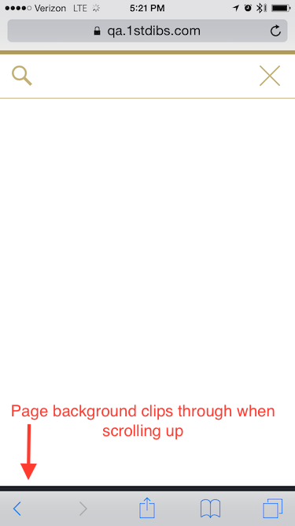

# Browser bugs

Date | Device Info (OS/Version, Browser/Version) | Bug Description | Other examples
--- | --- | --- | ---
2015-08-19 | iPhone 6/iOS 8.4/Safari, 10.10.5/Safari 8.0.8 | Repeated clicks on toggling nav elements will intermittently stop responding | <http://www.techcrunch.com/>, <http://www.bloomberg.com/>
2015-08-19 | iPhone 6/iOS 8.4/Safari, 10.10.5/Safari 8.0.8 | Scrolling a fixed position div down may clip the background color of the page through to the front (manifests as a colored bar at the bottom of the screen, see the screenshot below) | <http://www.westelm.com/>, <http://www.bloomberg.com/>
2015-08-31 | Safari 8.0.8 | SVGs aren't aligned unless you set `display: block` and `position: fixed`. | |

## Sample screenshots

Description | Image
--- | ---
Fixed-position div clipping | 

## SVG Alginment

To have an SVG diplay properly in Safari v8, make sure that it is set to `display: block` and make sure that both `height` and `width` are properly set for the DOM element.
